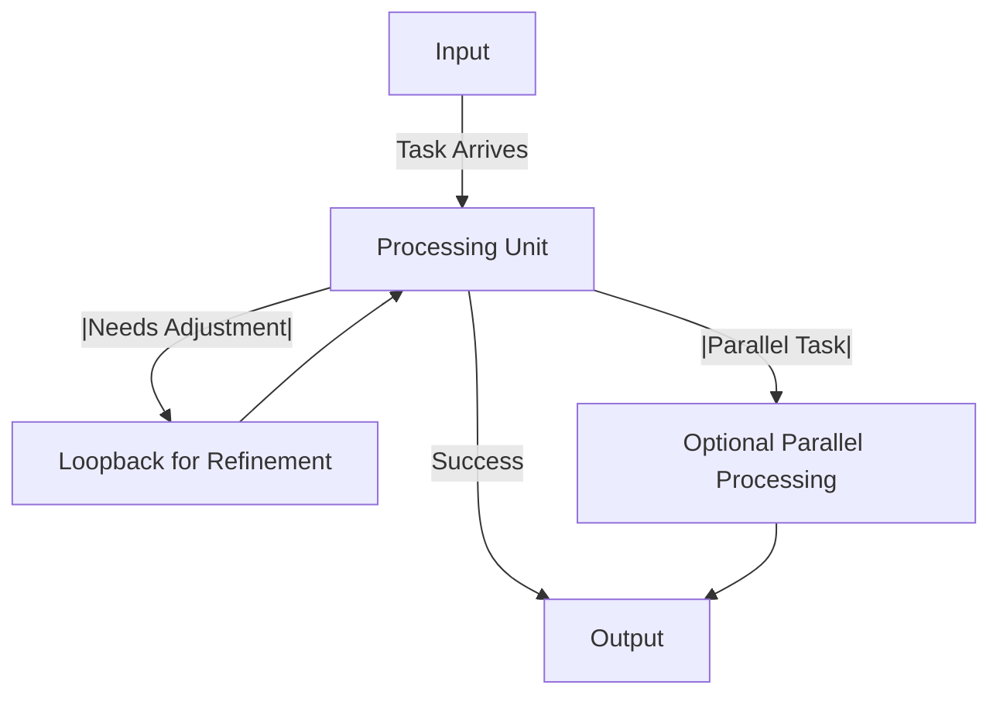
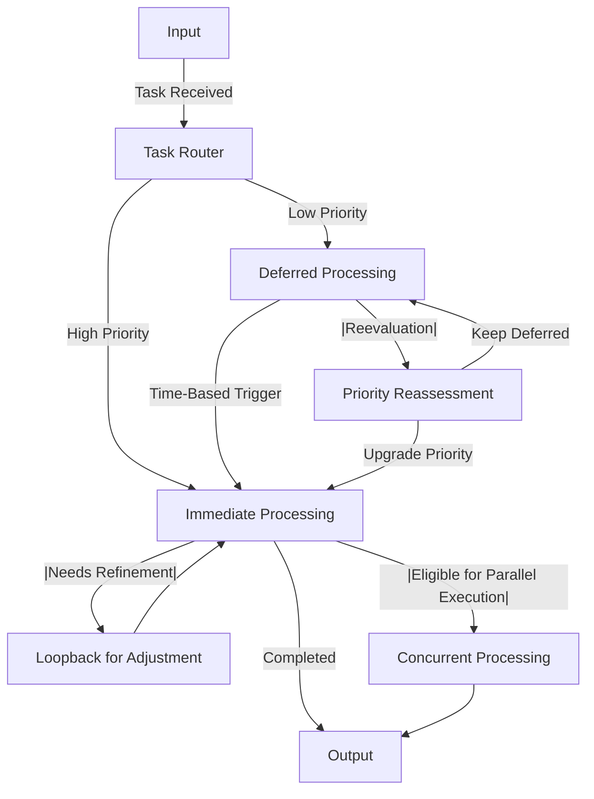
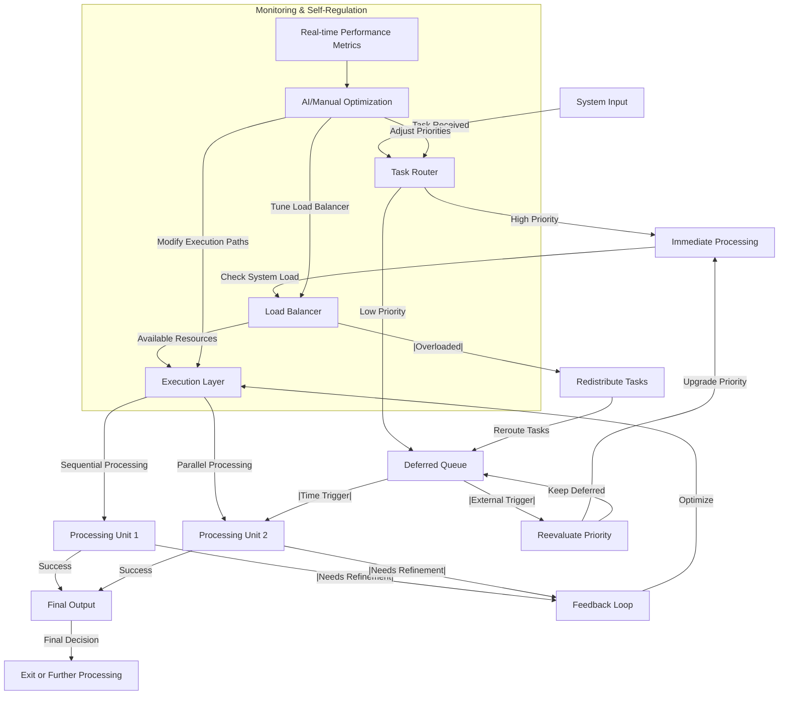

## Basic Diagram

**What This Represents:**

• **A → B → C:** A **basic flow** from **input → processing → output**.

• **B → D → B:** A **loopback mechanism** in case **refinement is needed**.

• **B → E → C:** An **optional parallel process** when needed.

-----
## Mild Diagram

**What’s Happening Here?**

• **A → B:** Tasks arrive at a **Task Router** that decides where they go.

• **Priority Handling:**

• **High-priority tasks → processed immediately.**

• **Low-priority tasks → deferred until needed.**

• **Loopback Refinement:** If a task needs improvement, it loops back **(F → C)** until optimized.

• **Parallel Execution (Optional):** Some tasks **split into parallel paths for efficiency.**

• **Dynamic Reassessment:** Deferred tasks can be **re-prioritized dynamically**.

-----

## High-End Diagram

**🔹 What’s Happening Here?**

1. **Input & Routing:**

• Tasks enter the **Task Router** and get **prioritized dynamically.**

• **High-priority tasks → Immediate processing.**

• **Low-priority tasks → Deferred queue for later reassessment.**

2. **Adaptive Load Balancing:**

• The **Load Balancer** checks system resources and **routes tasks accordingly.**

• **If overloaded → Tasks are redistributed** to avoid bottlenecks.

3. **Execution Layer:**

• Tasks run **sequentially** or in **parallel** based on need.

• Results are either **completed or sent for refinement** via the **Feedback Loop.**

4. **Dynamic Reassessment & Re-prioritization:**

• **Deferred tasks are rechecked** by time-based triggers or external inputs.

• **Priority can be upgraded or remain deferred** based on need.

5. **Monitoring & Self-Optimization:**

• **Real-time system metrics track efficiency.**

• **Manual/AI optimizations** dynamically **adjust priorities, execution paths, and load balancing.**

6. **Final Decision Layer:**

• Once processed, tasks **exit the system or continue further optimization** if needed.